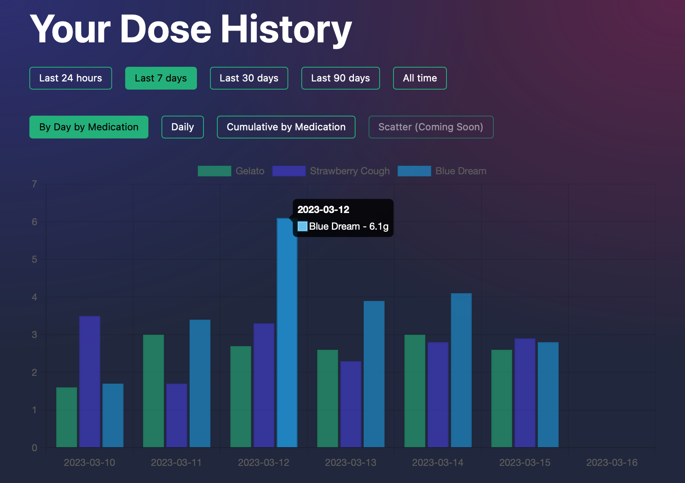

# Medication Tracker
This is a simple medication consumption tracker written in SvelteKit, and hosted (for free) on Cloudflare Pages, with data stored in Workers KV.

## Local and Cloud Mode
The app has two methods to store dose history. In Local Mode, data is stored in LocalStorage on the browser.
In Cloud Mode, a trpc mutation is sent when a medication is added, or a dose is logged. 
This updates KV stores attached to an (unused) Cloudflare Worker, and bound to this Pages site.
The doses are stored in a (slightly) compressed form, as an array of three values: `[medicationName, quantity, dateTime]

## Stats and Graphs
At the moment I've only written a few graphs - PRs, or GitHub Issues are welcome for any graphs you think would be useful.

